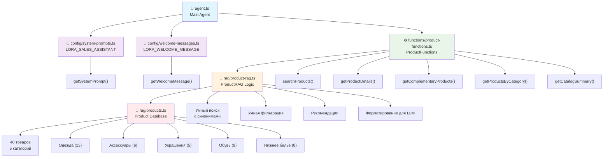

# Lora Sales Assistant - Модульная Архитектура

## Обзор

Этот агент представляет собой AI-ассистента продажника по имени Лора с 30-летним опытом в продажах. Лора работает в интернет-магазине одежды, аксессуаров, украшений, обуви и нижнего белья с каталогом из 40 товаров.

## Особенности Лоры

### Личность

- 30 лет опыта в продажах
- Дружелюбная и энергичная
- Эксперт в области моды и стиля
- Профессиональная, но не навязчивая

### Правила поведения

- ❌ Никогда не придумывает товары
- ✅ Использует только реальный каталог
- ✅ Честно сообщает о наличии товаров
- ✅ Уточняет предпочтения клиента
- ❌ Не упоминает о целях увеличения чека

### Цели

- Понять потребности клиента
- Предложить подходящие товары
- Создать привлекательные образы
- Мотивировать к дополнительным покупкам
- Показать ценность товаров

## Структура модулей

### 🏗️ Архитектура системы



## 📂 Структура файлов

### 🛒 Products Database (`rag/products.ts`)

**Назначение**: Хранение каталога товаров

- **Экспорты**:
  - `Product` - интерфейс товара
  - `PRODUCT_DATABASE` - массив из 40 товаров
- **Категории**:
  - `clothing` (13 товаров): платья, рубашки, джинсы, свитера, куртки, брюки
  - `accessories` (6 товаров): сумки, ремни, платки, шляпы, кошельки, перчатки
  - `jewelry` (5 товаров): цепочки, кольца, серьги, браслеты, часы
  - `shoes` (8 товаров): туфли, балетки, сапоги, кроссовки, ботинки, лоферы
  - `underwear` (8 товаров): бюстгальтеры, трусы, майки, термобелье, комплекты

### 🧠 RAG Logic (`rag/product-rag.ts`)

**Назначение**: RAG система для работы с товарами

- **Класс**: `ProductRAG`
- **Возможности поиска**:
  - Поиск по синонимам: "трусы" → находит категорию `underwear`
  - Поиск по обуви: "обувь", "туфли", "ботинки" → находит категорию `shoes`
  - Расширенное текстовое поле: включает категорию и подкатегорию
  - Прямое совпадение + семантический поиск

**Основные методы**:

```typescript
class ProductRAG {
  // Поиск с интеллектуальной логикой
  searchProducts(query: string, options?: ProductSearchOptions): Product[];

  // Получение товара по ID
  getProduct(id: string): Product | undefined;

  // Товары по категории
  getProductsByCategory(category: string): Product[];

  // Дополняющие товары с умной логикой
  getComplementaryProducts(productId: string): Product[];

  // Форматирование с русскими названиями категорий
  formatProductForLLM(product: Product): string;
  formatProductsForLLM(products: Product[]): string;

  // Статистика и аналитика
  getCategoryStats(): Record<string, number>;
  getAvailableCategories(): string[];
}
```

### ⚙️ Product Functions (`functions/product-functions.ts`)

**Функции для агента**:

- ✅ Поддержка всех 5 категорий: `clothing`, `accessories`, `jewelry`, `shoes`, `underwear`
- ✅ Функция `getCatalogSummary` для обзора каталога
- ✅ Интеграция с RAG системой

**Доступные функции**:

```typescript
{
  searchProducts: {
    // Поддерживает все 5 категорий
    category: 'clothing' | 'accessories' | 'jewelry' | 'shoes' | 'underwear'
  },

  getProductDetails: {
    // Детальная информация о товаре
  },

  getComplementaryProducts: {
    // Умные рекомендации
  },

  getProductsByCategory: {
    // Браузинг по категориям, поддерживает все 5 категорий
  },

  getCatalogSummary: {
    // Обзор всего каталога со статистикой
  }
}
```

### 📝 System Prompts (`config/system-prompts.ts`)

Конфигурация системных промптов с личностью и поведением Лоры.

### 💬 Welcome Messages (`config/welcome-messages.ts`)

Приветственные сообщения от имени Лоры.

### 🤖 Main Agent (`agent.ts`)

Основная логика агента, использующая все модули системы.

## 🔍 Возможности поиска

### Синонимы и семантический поиск

```typescript
// Примеры поисковых запросов:

// Нижнее белье
"трусы" → находит 8 товаров категории underwear
"белье" → находит всё нижнее белье

// Обувь
"обувь" → находит 8 товаров категории shoes
"туфли" → находит туфли на каблуке и классические туфли
"ботинки" → находит высокие сапоги и мужские ботинки
"кроссовки" → находит женские и мужские кроссовки
```

### Логика дополняющих товаров

```typescript
// Логика рекомендаций:

Одежда → Аксессуары + Украшения + Обувь
Нижнее белье → Одежда + Аксессуары
Обувь → Одежда + Аксессуары
Аксессуары → Одежда + Украшения
Украшения → Аксессуары + Одежда
```

## 🛠️ Настройка и расширение

### Добавление товаров

```typescript
// rag/products.ts
export const PRODUCT_DATABASE: Product[] = [
  // ... существующие товары
  {
    id: 'shoes_w_sandals_001',
    name: 'Летние сандалии',
    category: 'shoes',
    subcategory: 'sandals',
    gender: 'women',
    price: 3500,
    description: 'Удобные летние сандалии для отдыха',
    colors: ['коричневый', 'бежевый', 'белый'],
    sizes: ['36', '37', '38', '39', '40'],
    inStock: true,
    tags: ['сандалии', 'летние', 'удобные', 'отдых'],
  },
];
```

### Расширение поиска

```typescript
// rag/product-rag.ts - добавление синонимов
if ((term.includes('сандал') || term === 'летняя обувь') &&
    product.category === 'shoes' && product.subcategory === 'sandals') {
  return true;
}
```

### Добавление функций

```typescript
// functions/product-functions.ts
getProductsOnSale: {
  description: 'Найти товары со скидкой',
  parameters: z.object({
    maxDiscount: z.number().optional()
  }),
  execute: async ({ maxDiscount }) => {
    // Логика поиска товаров со скидкой
  }
}
```

## 📊 Статистика каталога

```bash
# Текущая статистика:
{
  clothing: 13,      # Одежда
  accessories: 6,    # Аксессуары
  jewelry: 5,        # Украшения
  shoes: 8,          # Обувь
  underwear: 8       # Нижнее белье
}

# Всего: 40 товаров
```

## 🚀 Запуск и тестирование

### Базовый запуск

```bash
# Сборка проекта
npm run build

# Запуск агента
npm start
```

### Тестирование поиска

```bash
# Тест поиска товаров
node -e "
import { ProductRAG } from './dist/rag/product-rag.js';
const rag = new ProductRAG();
console.log('Трусы:', rag.searchProducts('трусы').length);
console.log('Обувь:', rag.searchProducts('обувь').length);
"
```

## 🔧 Важные особенности реализации

### ES Modules и импорты

Проект использует `"type": "module"` в package.json, поэтому:

- ✅ Импорты должны содержать расширение `.js`
- ✅ `moduleResolution: "node"` в tsconfig.json
- ✅ Структура: `product-rag.ts` импортирует из `products.ts`

### Разделение ответственности

- **products.ts**: Только данные - легко редактировать каталог
- **product-rag.ts**: Только логика - легко улучшать поиск
- **product-functions.ts**: Только API для агента - легко добавлять функции

### OpenAI Realtime API

При работе с функциями для OpenAI Realtime API:

- ❌ Не используйте `.default()` в zod схемах
- ✅ Обрабатывайте значения по умолчанию в самих функциях
- ✅ Используйте `.optional()` для необязательных параметров
- ✅ Все 5 категорий поддерживаются в enum

## 🎯 Возможности для развития

### Идеи для расширения

1. **Добавление изображений**: Поле `images` уже есть в интерфейсе
2. **Система скидок**: Добавить поля `originalPrice`, `discount`
3. **Отзывы**: Добавить рейтинги и отзывы покупателей
4. **Размерная сетка**: Детальные таблицы размеров
5. **Сезонность**: Фильтры по сезону/погоде
